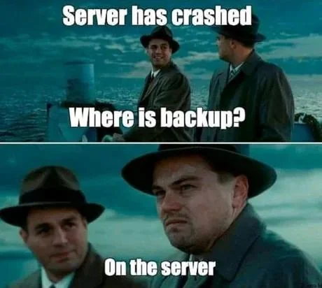

# Go

- Understand the syntax of Go
- Building blocks of Go
- What a Go program consists of
- What are modules
- What is an entrypoint
- Best practices for error handling
- Composition
- Go routines
- How to compile
- How to run
- How to debug
- How to test
- How to document

 
 
 
 
 
 
 
 
 
 

It is important to get a feel for how *maintainable* software is composed.

 
 
 
 
 
 
 
 
 
 

 
 
 
 
 
 
 
 
 
 

There are many aspects that make software maintainable, but one of the most important is the ability to understand the code.

 
 
 
 
 
 
 
 
 
 

Another is being able to run the code. In a repeatable way. In a predictable way.
