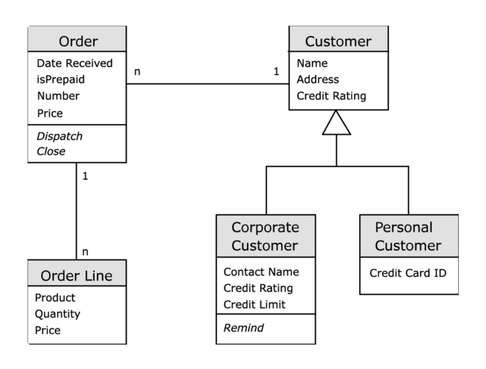
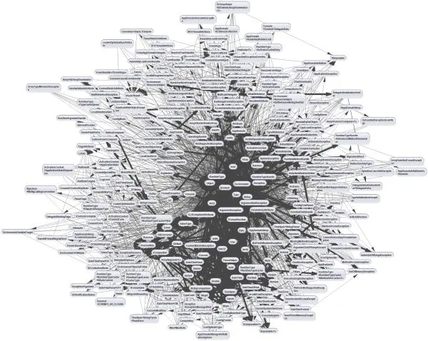
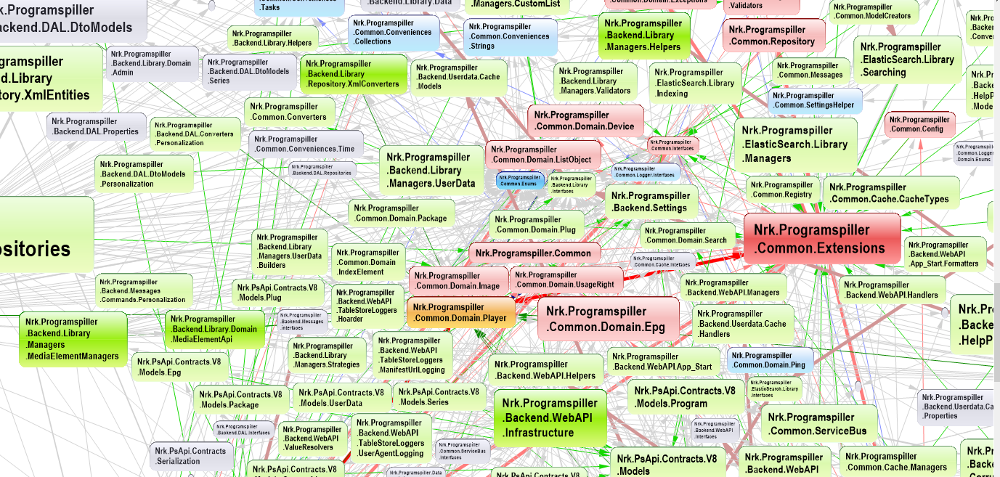

# What is Object Oriented Programming?

Object Oriented Programming (OOP) is a programming paradigm that uses objects to design applications and computer programs.

</br>
</br>
</br>
</br>
</br>
</br>
</br>
</br>
</br>
</br>

## The four pillars of object-oriented programming

1. Abstraction
2. Encapsulation
3. Inheritance
4. Polymorphism

</br>
</br>

Let's look at each of these in more detail.

</br>
</br>
</br>
</br>
</br>
</br>
</br>
</br>
</br>
</br>

## Abstraction

To abstract something away means to hide away the implementation details inside something.

Sometimes a **class**, sometimes a **function**, sometimes a **library**.

</br>
</br>

### Example: Making coffee

**With abstraction:**

- "Make coffee"

**Without abstraction:**

- "Turn on the coffee machine"
- "Grind the coffee beans"
- "Pour water into the coffee machine"
- "Wait for the coffee to be ready"
- "Pour the coffee into a cup"
- "Add sugar"
- "Add milk"
- "Stir the coffee"

</br>
</br>

### Example: Haircut

```python
def get_price_of_haircut(haircut):
    if haircut == "short":
        return 100
    elif haircut == "medium":
        return 200
    elif haircut == "long":
        return 300
    else:
        return 0

get_price_of_haircut("short")
```

</br>
</br>
</br>
</br>
</br>
</br>
</br>
</br>
</br>
</br>

## Encapsulation

Encapsulation is "the action of enclosing something in or as if in a capsule."

Typically, access to parts of the code is restricted. Encapsulation means each object _should_ control its own state.

Also referred to as "information hiding".

</br>
</br>


</br>
</br>
</br>
</br>
</br>
</br>
</br>
</br>
</br>
</br>

## Inheritance

Inheritance is a mechanism in which one class acquires the properties and behavior of another class.

Reusability is the main benefit here.

</br>
</br>
</br>
</br>
</br>
</br>
</br>
</br>
</br>
</br>

**High cohesion, low coupling**

</br>
</br>
</br>
</br>
</br>
</br>
</br>
</br>
</br>
</br>

**High cohesion:** "The degree to which the elements inside a module belong together."

Low cohesion = undesirable—we have functionality made up of code that is spread across the code-base.

</br>
</br>
</br>
</br>
</br>
</br>
</br>
</br>
</br>
</br>

**Low coupling:** "The degree to which one module relies on another module."

High coupling = undesirable—we know too much about the other modules and their inner workings.

</br>
</br>

**Example:** Does the `Car` class know about the `Engine` class?

**Example:** Does the `Bird` class know about the `Wing` class?

**Example:** Does the `Billing` module know how the `VisaPayment` library's `pay` function works?

</br>
</br>
</br>
</br>
</br>
</br>
</br>
</br>
</br>
</br>

```text
"We want to design components that are self-contained: independent, and with
a single, well-defined purpose."

—— The Pragmatic Programmer
```

More about [coupling and cohesion](https://medium.com/clarityhub/low-coupling-high-cohesion-3610e35ac4a6).

</br>
</br>
</br>
</br>
</br>
</br>
</br>
</br>
</br>
</br>

## Polymorphism

Refers to the ability of a variable, function, or object to take on multiple forms.

When two types share an inheritance chain, they can be used interchangeably with no errors or assertions in the code.

It allows for the same method to do different things based on the object it is called on. The real power of polymophism is sharing behaviors and allowing custom overrides.

</br>
</br>
</br>
</br>
</br>
</br>
</br>
</br>
</br>
</br>

## A simple class diagram


Source: https://www.researchgate.net/figure/A-simple-class-diagram-for-a-commercial-software-application-in-UML-notation-The_fig3_225686440

</br>
</br>
</br>
</br>
</br>
</br>
</br>
</br>
</br>
</br>

## Can also be complex


Source: https://v5.scaledagileframework.com/domain-modeling/

</br>
</br>
</br>
</br>
</br>
</br>
</br>
</br>
</br>
</br>

## "Big ball of mud"

Unfortunately, **a very popular design pattern** in the industry is the "big ball of mud" design pattern. This is when the code is not well organized and is difficult to maintain.

</br>
</br>

> It is _not_ a design pattern—it is an anti-pattern.

</br>
</br>
</br>
</br>
</br>
</br>
</br>
</br>
</br>
</br>


Source: https://medium.com/@e0310443/the-big-ball-of-mud-amplifying-the-importance-of-software-engineering-principles-6e2eac5979cb

Source: https://nrkbeta.no/2017/04/29/undoing-the-harm-of-layers/

</br>
</br>
</br>
</br>
</br>
</br>
</br>
</br>
</br>
</br>

> What is a class?

</br>
</br>
</br>
</br>
</br>
</br>
</br>
</br>
</br>
</br>

> What is an object?

</br>
</br>
