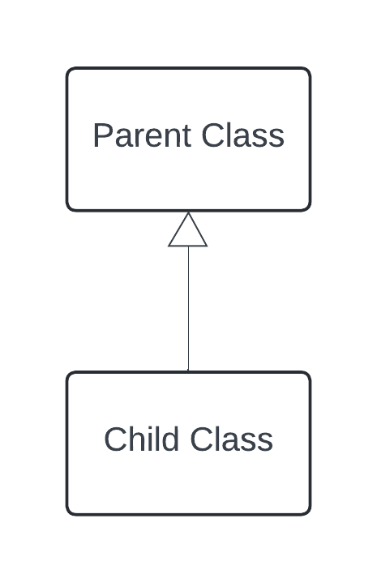

# Inheritance

Inheritance implements an **"is-a"** relationship. It allows a class to inherit the properties and methods of another class.

- The class that inherits is called the **subclass** or **child class**.
- The class that is inherited from is called the **superclass** or **parent class**.

</br>
</br>
</br>
</br>
</br>
</br>
</br>
</br>
</br>
</br>



</br>
</br>
</br>
</br>
</br>
</br>
</br>
</br>
</br>
</br>

```python
class Animal:

    # attribute and method of the parent class
    name = ""
    
    def eat(self):
        print("I can eat")

# inherit from Animal
class Dog(Animal):

    # new method in subclass
    def display(self):
        # access name attribute of superclass using self
        print("My name is ", self.name)
```

```python
# create an object of the subclass
labrador = Dog()

# access superclass attribute and method 
labrador.name = "Darth Vader"
labrador.eat()

# call subclass method 
labrador.display()
```

</br>
</br>

**Output:**

```text
I can eat
My name is  Darth Vader
```

</br>
</br>

**Overriding the `eat()` method and calling the superclass method:**

```python
# call method of superclass
super().eat()
```

</br>
</br>

Source: https://www.programiz.com/python-programming/inheritance

</br>
</br>
