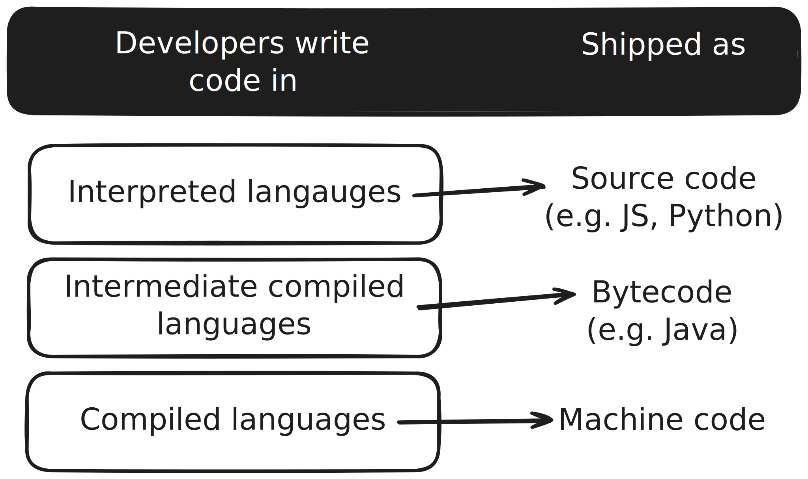

# Go basics

In this lesson, we will cover the fundamentals of the Go programming language.

</br>
</br>
</br>
</br>
</br>
</br>
</br>
</br>
</br>
</br>
</br>

- Syntax rules; use of curly braces, case-sensitivity, comments
- Modules
- Variables, types and constants
- Data types
- Visibility
- Collections
- Numbers
- Functions
- Pointers and references
- Control structures
- panic, defer
- Error handling design pattern
- Packages to organize, share and use code

</br>
</br>
</br>
</br>
</br>
</br>
</br>
</br>
</br>
</br>
</br>

As a practical exercise (well, many exercises) along the way, we are going to build a command line tool that can compress and decompress bitmap images.

</br>
</br>
</br>
</br>
</br>
</br>
</br>
</br>
</br>
</br>
</br>

## Language types

</br>
</br>



</br>
</br>
</br>
</br>
</br>
</br>
</br>
</br>
</br>
</br>
</br>


</br>
</br>
</br>
</br>
</br>
</br>
</br>
</br>
</br>
</br>
</br>

## Basic rules

- We use `.go` files
- Code blocks in `{}`
- No styling freedom
- We do have semi-colon to separate sentences
- They are optional though
- Case-senstive
- Strongly typed
- NOT an object-oriented language
- No classes, no inheritance
- No exceptions, no try-catch

</br>
</br>
</br>
</br>
</br>
</br>
</br>
</br>
</br>
</br>
</br>

- We have one file acting as the entry point with a main function
- A folder is a package
- Packages can have simple names (utilities) or URLs (github.com/username/project)
- Within one `.go` file, we can have:
  - Variables
  - Functions
  - Type declarations
  - Method declarations

</br>
</br>
</br>
</br>
</br>
</br>
</br>
</br>
</br>
</br>
</br>

## Modules

- A module is a group of packages
- You can think of it as a project
- Modules contain a `go.mod` file that contains the module name, configuration and metadata (about dependencies)

> **Note:** While having a module for a directory is not mandatory for Go code to run, modules is a way to organize your code and dependencies into chunks much like a small project. By creating the `go.mod` file, you are creating a module. The real power of modules comes into light when you start to use dependencies as a module helps you manage them.

</br>
</br>
</br>
</br>
</br>
</br>
</br>
</br>
</br>
</br>
</br>

## CLI

It manipulates the module
- `go mod init` -> initializes the module
- `go build` -> builds the module
- `go test` -> tests the module
- `go run` -> builds and runs the module
- `go get` -> retrieves dependencies

</br>
</br>
</br>
</br>
</br>
</br>
</br>
</br>
</br>
</br>
</br>

## Creating a module

1. Create a new folder (e.g. `gointro`)
2. Run `go mod init <module-name>`

</br>
</br>

You will get a `go.mod` file with the module name and Go version the code is to be compiled in.

Very simple.

</br>
</br>
</br>
</br>
</br>
</br>
</br>
</br>
</br>
</br>
</br>

`go.mod` example:

```go
module itu.com/bds/gointro

go 1.23
```

</br>
</br>
</br>
</br>
</br>
</br>
</br>
</br>
</br>
</br>
</br>

## Running the module

```bash
go run .
```

</br>
</br>
</br>
</br>
</br>
</br>
</br>
</br>
</br>
</br>
</br>

If you are coming from **JavaScript**, the `go.mod` file is similar to the `package.json` file.

Similarly, if you are coming from **Python**, the `go.mod` file is similar to the `requirements.txt`. Or `pyproject.toml` file when using Poetry.

</br>
</br>
</br>
</br>
</br>
</br>
</br>
</br>
</br>
</br>
</br>

## Workspaces

Kind of a "super module" that can be used to organize projects into multiple modules.

- Introduced in Go 1.18

It contains a `go.work` file that contains configuration and metadata—including which module to use.

The Go CLI manipulates the workspace.

</br>
</br>
</br>
</br>
</br>
</br>
</br>
</br>
</br>
</br>
</br>

## Creating a workspace

1. Create a new folder
2. `go work init <modules-directory>`

The `go work init` command tells *go* to create a `go.work` file for a workspace containing the modules in the `<modules-directory>` directory.

For more details: https://go.dev/doc/tutorial/workspaces

</br>
</br>
</br>
</br>
</br>
</br>
</br>
</br>
</br>
</br>
</br>

`go.work` example:

```go
go 1.23

use ./gointro
```

</br>
</br>
</br>
</br>
</br>
</br>
</br>
</br>
</br>
</br>
</br>

But really, modules and packages are all you are going to need.
