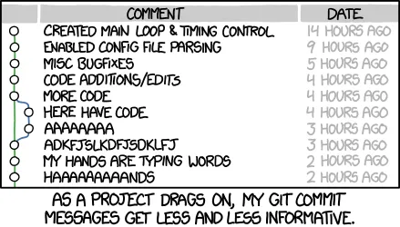

## Semantic commit messages

People who work on code and version control it in a repository (e.g. git), often do not think about the importance of writing good commit messages. Especially as the amount of contributors increase—both concurrently and over time as people come and go.

</br>



</br>
</br>
</br>
</br>
</br>
</br>
</br>
</br>
</br>
</br>
</br>

## It is pretty simple, really

We prefix the commit message with a type, and then a description.

```plaintext
feat:     # work related to a feature
docs:     # changes to documentation
fix:      # bug fix
style:    # formatting
refactor: # refactoring and reducing technical debt
test:     # changes related to tests
chore:    # changes that are minor, like updating dependencies
ci:       # changes to pipelines, build systems, etc.
```

</br>

A prefix can also be scoped ( `feat(scope): description` ), and the description can be multiline.

And breaking changes can be highlighted with a `!` after the type/scope, e.g. `feat!: description`.

</br>

> Read more about semantic commit message and conventional commits here: https://www.conventionalcommits.org/en/v1.0.0/

</br>
</br>
</br>
</br>
</br>
</br>
</br>
</br>
</br>
</br>
</br>

Semantic commit messages is a pattern that can also be applied at the user story level in many backlogs (Scrum/Kanban).

</br>
</br>
