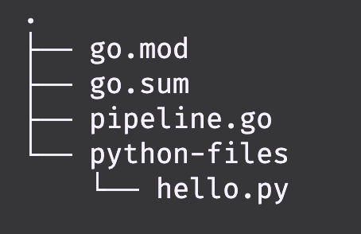

## Create a new pipeline

</br>

### Pseudo structure of the pipeline (in Go)

```go
package main

func main() {
    // Create a shared background context

    // Run pipeline stages
    stage()
}

func stage() {
    // Create a Dagger client
    // Define the code you want to run
}
```

</br>
</br>
</br>
</br>
</br>
</br>
</br>
</br>
</br>
</br>
</br>

For our example, we want to create a pipeline that does the following:

1. Sets up a Docker container from a specific image.
2. Takes a python file from a local directory on the host environment.
3. Runs the python file in a Docker container.
4. Copies the output from the Docker container to a local directory on the host environment.

</br>
</br>
</br>
</br>
</br>
</br>
</br>
</br>
</br>
</br>
</br>


</br>
</br>
</br>
</br>
</br>
</br>
</br>
</br>
</br>
</br>
</br>

## Directories and files

We need to create some directories and files for this to work. This is what we are aiming for:



</br>
</br>
</br>
</br>
</br>
</br>
</br>
</br>
</br>
</br>
</br>

First create the `go` directory and initialize the Go module:

```bash
mkdir go

cd go

go mod init daggerpipeline
```

</br>
</br>
</br>
</br>
</br>
</br>
</br>
</br>
</br>
</br>
</br>

Then create the `pipeline.go` file:

```bash
touch pipeline.go
```

</br>
</br>

Add the following code to the `pipeline.go` file:

```go
package main

import (
	"context"
	"fmt"

	"dagger.io/dagger"
)

func main() {
	// Create a shared context
	ctx := context.Background()

	// Run the stages of the pipeline
	if err := Build(ctx); err != nil {
		fmt.Println("Error:", err)
		panic(err)
	}
}

func Build(ctx context.Context) error {
	// Initialize Dagger client
	client, err := dagger.Connect(ctx)
	if err != nil {
		return err
	}
	defer client.Close()

	python := client.Container().From("python:3.12.2-bookworm").
		WithDirectory("python", client.Host().Directory("python-files")).
		WithExec([]string{"python", "--version"})

	python = python.WithExec([]string{"python", "python/hello.py"})

	_, err = python.
		Directory("output").
		Export(ctx, "output")
	if err != nil {
		return err
	}

	return nil
}
```

</br>
</br>

We need to download the Go dependencies as well:

```bash
go mod tidy
```

</br>
</br>
</br>
</br>
</br>
</br>
</br>
</br>
</br>
</br>
</br>

Next, create a directory for the python file and add a python file called `hello.py`:

```bash
mkdir python-files

cd python-files

touch hello.py
```

The content of `hello.py`:

```python
# Write to a file in a new directory called "output"
import os

os.makedirs("output", exist_ok=True)

with open("output/hello-from-python.txt", "w") as f:
    f.write("Hello from Python in Dagger!\n")
```

</br>
</br>
</br>
</br>
</br>
</br>
</br>
</br>
</br>
</br>
</br>

All good now! Next, we will try and run it locally.

Remember to navigate back to the `go` directory before running Dagger!

</br>
</br>

You can also find the complete example here [GitHub](https://github.com/lasselundstenjensen/dagger-in-practice/tree/main/go).

</br>
</br>
